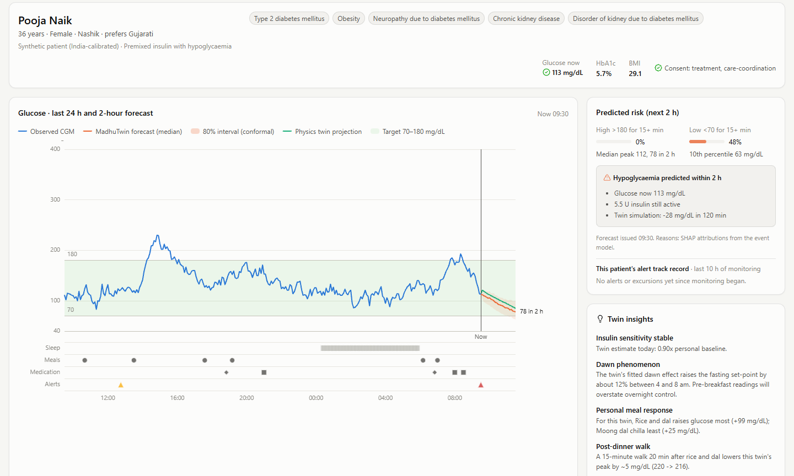

# MadhuTwin: a hybrid digital twin for Type 2 Diabetes

**Happiest Health Digital Twin Challenge 2026 · Phase 1 submission**

MadhuTwin builds a living virtual replica of a person with type 2 diabetes. It fuses their electronic health record with wearable streams, simulates their glucose–insulin physiology, stays synchronised with their CGM every 5 minutes, and **warns a doctor up to 2 hours before a glucose spike or a hypoglycaemic episode**, with the reasons and "what-if" simulations to act on it.

<!-- RESULTS_HEADLINE -->

**Headline results (unseen patients):** 60-min forecast error 18.0 mg/dL vs 35.8 for persistence; 99.5% clinically acceptable (Clarke A+B); 90% of glucose spikes flagged a median 110 min ahead with at most 1 false alert per patient-day; fusing both streams + the physics twin cuts 60-min error from 24.9 (CGM only) to 18.4 mg/dL. The twin learns each person: 2-hour error falls from 31.4 to 27.2 mg/dL after a week of their data. On 45 real people (CGMacros): 22.4 vs 28.3 mg/dL.

<!-- /RESULTS_HEADLINE -->

|                                           |                                                                                                                          |
| ----------------------------------------- | ------------------------------------------------------------------------------------------------------------------------ |
| Demo video (15–20 min, unlisted YouTube) | **TODO(team): unlisted YouTube link**                                                                              |
| Live demo                                 | **TODO(team): live link** (free on Render: [`deploy/render.md`](deploy/render.md)); locally `docker compose up` |
| Architecture diagram                      | [`docs/architecture.pdf`](docs/architecture.pdf) · [`docs/architecture.pptx`](docs/architecture.pptx)                 |
| Presentation                              | [`docs/presentation.pdf`](docs/presentation.pdf) · [`docs/presentation.pptx`](docs/presentation.pptx)                 |
| Technical report · Evaluation report     | [`docs/technical_report.pdf`](docs/technical_report.pdf) · [`docs/evaluation_report.md`](docs/evaluation_report.md)   |
| Model card · Privacy (DPDP)              | [`docs/model_card.md`](docs/model_card.md) · [`docs/dpdp_compliance.md`](docs/dpdp_compliance.md)                     |




## Submission checklist

| Required item                             | Where                                                                                                                                       |
| ----------------------------------------- | ------------------------------------------------------------------------------------------------------------------------------------------- |
| Team details                              | [1. Team details](<Shubham suman>)                                                                                                           |
| College / incubator information           | [1. Team details](#1-team-details)                                                                                                           |
| Project title                             | [2. Project title](#2-project-title)                                                                                                         |
| Problem statement                         | [3. Problem statement and healthcare use case](#3-problem-statement-and-healthcare-use-case)                                                 |
| Healthcare use case                       | [Healthcare use case](#healthcare-use-case)                                                                                                  |
| Technical stack                           | [6. Technical stack, AI/ML models and frameworks](#6-technical-stack-aiml-models-and-frameworks)                                             |
| AI/ML model and framework details         | [AI/ML models](#aiml-models), [4. What makes it a digital twin](#4-what-makes-it-a-digital-twin), [`docs/model_card.md`](docs/model_card.md) |
| Demo video (15–20 min, unlisted YouTube) | Link in the table above                                                                                                                     |
| Open-source licence                       | [10. Open-source licence](#10-open-source-licence) (Apache-2.0, [`LICENSE`](LICENSE))                                                       |
| Architecture diagram (PDF and PPT)        | [`docs/architecture.pdf`](docs/architecture.pdf) · [`docs/architecture.pptx`](docs/architecture.pptx)                                    |
| Presentation (PDF and PPT)                | [`docs/presentation.pdf`](docs/presentation.pdf) · [`docs/presentation.pptx`](docs/presentation.pptx)                                    |
| All files and links publicly accessible   | Everything is in this public repository; the video is an unlisted YouTube link                                                              |

---

## 1. Team details

|                     |                                                       |
| ------------------- | ----------------------------------------------------- |
| Team name           | Praise                                                |
| College / incubator | IIT Kharagpur                                         |
| Team leader         | Shubham suman, Shubhamsuman2005@gmail.com, 7318606818 |
| Members             | **TODO(team)**: name, programme, role           |

## 2. Project title

**MadhuTwin: a hybrid physiological + AI digital twin that fuses EHR and wearable data to predict glycaemic events in people with Type 2 Diabetes in India.**

*Madhumeha* is the classical Indian name for diabetes.

## 3. Problem statement and healthcare use case

### Problem statement

India has about **101 million people with diabetes and 136 million with prediabetes** (ICMR-INDIAB, *Lancet Diabetes & Endocrinology* 2023). Care is reactive: a quarterly HbA1c shows what already happened, while day-to-day risk sits unseen between visits. That risk includes post-meal spikes from high-carbohydrate meals, night-time lows from sulfonylureas or premixed insulin, and loss of control during illness. CGMs and smartwatches now produce the data to see it, but a clinician cannot watch hundreds of streams.

### Healthcare use case

**Remote monitoring by a diabetes care team.** For every patient, MadhuTwin:

1. **Predicts** glucose for the next 5–120 minutes with an 80% interval, and the probability of a sustained excursion above 180 mg/dL or below 70 mg/dL within 2 hours.
2. **Prioritises** the panel by risk, raising alerts with plain-language reasons and each patient's own alert track record (how many past alerts came true, and how early). Example: *"62 g carbohydrate still being absorbed · Rising 18 mg/dL over 30 min · Insulin sensitivity 34% below personal baseline"*.
3. **Explains and simulates.** The doctor tests "what if she walks 15 minutes after dinner?", "swap rice-sambar for jowar roti?" or "what if he is unwell?" on the patient's own twin.
4. **Detects hidden change.** The synced twin tracks insulin sensitivity day to day, flagging illness or stress from CGM alone.
5. **Interoperates.** It exports FHIR R4, including a `RiskAssessment` resource carrying the forecast, aligned with the ABDM terminology stack.

## 4. What makes it a digital twin

A predictive model alone is not a twin. MadhuTwin implements the three defining properties:

| Property                                                       | Implementation                                                                                                                                                                                                                                                                                                                                                               |
| -------------------------------------------------------------- | ---------------------------------------------------------------------------------------------------------------------------------------------------------------------------------------------------------------------------------------------------------------------------------------------------------------------------------------------------------------------------- |
| **Model**: a virtual replica of the patient's physiology | Extended Bergman minimal model: endogenous insulin secretion, incretin effect, meal absorption by GI/fat/fibre, exercise, sleep-driven insulin sensitivity, dawn phenomenon, counter-regulation, and Indian prescribing (metformin, sulfonylureas, DPP-4i, SGLT2i, premixed 30/70 and basal insulin). Personalised by MAP fitting of 5 parameters, with priors from the EHR. |
| **Sync**: continuously updated from real-time data       | An Unscented Kalman Filter updates hidden state (plasma glucose, insulin, insulin action) and a drifting insulin-sensitivity factor from every CGM reading.                                                                                                                                                                                                                  |
| **Simulate**: run forward to predict and explore         | Strictly causal 2-hour forecasts; counterfactual what-ifs (meals from an Indian food table, walks, insulin, sleep, illness); and a 24-hour**therapy simulator** (insulin and sulfonylurea doses and timing, DPP-4 and SGLT2 inhibitors) with a built-in trust check: the twin replays the last 24 h against the CGM before its simulation is shown.                    |

**TwinNet** sits on top: a physics-gated fusion network that combines both data streams with the twin's own forecast and learns *how much to trust physics at each horizon*. Then the twin learns the individual: TwinNet is fine-tuned for a few seconds on each person's own earlier days and averaged with a LightGBM fusion model. This **MadhuTwin ensemble** is what the dashboard shows.

## 5. Two data streams, fused

| Stream                              | Content                                                                                                                                                                                                                                                    | Sources                                                                                                                                                                       |
| ----------------------------------- | ---------------------------------------------------------------------------------------------------------------------------------------------------------------------------------------------------------------------------------------------------------- | ----------------------------------------------------------------------------------------------------------------------------------------------------------------------------- |
| **Static / historical (EHR)** | Demographics, diagnoses (SNOMED CT), labs (LOINC: HbA1c, FPG, fasting insulin, lipids, eGFR, uACR, B12, TSH), medications with timing (WHO ATC), 2-year lab history, family history,**genetic markers** (TCF7L2 rs7903146, T2D polygenic risk score) | Synthetic India cohort (FHIR R4), CGMacros labs, BIG IDEAs HbA1c and demographics, ShanghaiT2DM clinical records                                                              |
| **Dynamic (wearables / IoT)** | CGM (5- or 15-min), heart rate, HRV (RMSSD), steps, METs, sleep stages, logged meals and doses                                                                                                                                                             | Synthetic device models (Apple Health / Libre-style), CGMacros (Dexcom, Libre, Fitbit), BIG IDEAs (Dexcom G6 + Empatica E4: real heart rate and HRV), ShanghaiT2DM (CGM only) |

**Data used (sandbox rules respected: synthetic and open data only)**

- **Synthetic India-calibrated cohort, 1,000 patients × 14 days.** EHR drawn from Indian epidemiology (ICMR-INDIAB, South-Asian BMI phenotype, regional diets from IFCT 2017, Indian prescribing). Wearable streams are *generated by the same physiology*, so the two streams are causally coupled; labs are measured from the simulated body (HbA1c from mean glucose via ADAG). Physiological parameter distributions come from twins fitted to 45 real people.
- **[CGMacros](https://physionet.org/content/cgmacros/1.0.0/)** (PhysioNet, CC BY-NC-SA 4.0): 45 adults (healthy, prediabetic, T2D) with two CGMs, Fitbit, meal macros and labs. This is the real-world validation set.
- **[BIG IDEAs Glycemic Variability and Wearable Device Data](https://physionet.org/content/big-ideas-glycemic-wearable/1.1.2/)** (PhysioNet, ODC-By 1.0): 16 adults with normal glucose or prediabetes, Dexcom G6 CGM with an Empatica E4 wristband and food logs. We derive 5-minute HRV (RMSSD) from the raw inter-beat intervals, so this is the real-wearables test.
- **[ShanghaiT2DM](https://figshare.com/articles/dataset/20444397)** (Figshare, CC BY 4.0): 100 T2D patients (109 recordings) on a rice-based diet with heavy insulin use and *no wearables*. This is the external, missing-modality test.

## 6. Technical stack, AI/ML models and frameworks

### AI/ML models

| Model                           | Type                                                                                                                                                        | Role                                                               |
| ------------------------------- | ----------------------------------------------------------------------------------------------------------------------------------------------------------- | ------------------------------------------------------------------ |
| Personalised physiological twin | Extended Bergman minimal model (ODEs), MAP-fitted per patient with EHR priors                                                                               | MODEL: the patient's glucose–insulin physiology                   |
| Synchronisation                 | Unscented Kalman Filter (7 states incl. drifting insulin sensitivity)                                                                                       | SYNC: hidden state from every CGM reading; illness detection       |
| TwinNet                         | PyTorch deep network: causal dilated temporal convolution, FiLM conditioning on the EHR, physics-gated residual, quantile and event heads, modality dropout | 5–120 min glucose forecast with 80% interval; spike and hypo risk |
| LightGBM fusion                 | Gradient-boosted quantile regressors and event classifiers with TreeSHAP                                                                                    | Second forecaster; plain-language reasons for every alert          |
| MadhuTwin ensemble              | TwinNet fine-tuned per patient, averaged with LightGBM; Platt recalibration; conformal intervals                                                            | What the dashboard shows                                           |
| Therapy simulator               | 24-h open-loop simulation on the synced twin, with a replay trust check                                                                                     | Try dose and drug changes before prescribing                       |

### Technical stack

| Layer               | Stack                                                                                                                                                                                                                                                 |
| ------------------- | ----------------------------------------------------------------------------------------------------------------------------------------------------------------------------------------------------------------------------------------------------- |
| Physiology and sync | Python 3.12, NumPy, SciPy (Powell MAP fit), Numba-compiled ODE integrator (verified equal to the NumPy reference; 12× faster end-to-end per patient), custom vectorised UKF                                                                          |
| ML                  | PyTorch (TwinNet: causal dilated TCN + FiLM EHR conditioning + physics-gated residual + quantile and event heads + modality dropout), conformalised quantile intervals; LightGBM (quantile regressors, event classifiers) + TreeSHAP for explanations |
| Health standards    | HL7 FHIR R4 (validated with`fhir.resources`), SNOMED CT, LOINC, UCUM, WHO ATC, dbSNP                                                                                                                                                                |
| Serving             | FastAPI, WebSocket live replay, purpose-tagged audit trail; optional grounded LLM assistant (Claude via the Anthropic SDK, tool use over the twin; off by default)                                                                                    |
| Dashboard           | React 18 + TypeScript + Vite, Tailwind CSS 4, Apache ECharts (palette validated for colour-vision deficiency; light and dark themes); three.js + React Three Fiber for the 3D virtual patient                                                         |
| Ops                 | Docker (multi-stage), docker-compose, GitHub Actions CI (pytest + ruff + dashboard build)                                                                                                                                                             |

**Evaluation protocol.** Patient-level splits throughout. Synthetic: 70/10/20 by patient, scored only on days 8–14 after personalisation. Real data: 5-fold CV grouped by patient. Metrics: RMSE / MAE / MARD per horizon, Clarke Error Grid, 80% interval coverage, AUROC / AUPRC with patient-bootstrap CIs, excursions caught, lead time and false alerts per day, and the share of excursions caught with at most one false alert per patient-day (alert thresholds chosen on training folds only). Clinical utility: calibration, decision curves and a subgroup audit (sex, age, BMI by Asian cut-offs, status, therapy, region). Stream-by-stream ablations and a learning curve of error against days of personal data are included.

<!-- RESULTS_TABLE -->

### Results

MadhuTwin = the mechanistic twin fitted to each person's own earlier data, TwinNet fine-tuned on the same data and averaged with LightGBM; risks are recalibrated on held-out patients (validation patients, or other folds' patients for real data). Real-data models are pretrained on the synthetic cohort and fine-tuned on the training folds only (sim-to-real).

| Evaluation                                                                       | Metric                                                                                     |                                                                                           MadhuTwin |                    Persistence baseline |
| -------------------------------------------------------------------------------- | ------------------------------------------------------------------------------------------ | --------------------------------------------------------------------------------------------------: | --------------------------------------: |
| Synthetic India cohort, 199 unseen patients                                      | RMSE 30 / 60 / 120 min (mg/dL)                                                             |                                                                                  13.0 / 18.0 / 23.3 |                      22.9 / 35.8 / 50.4 |
|                                                                                  | Clarke A+B at 60 min                                                                       |                                                                                               99.5% |                                   98.2% |
|                                                                                  | Spike >180 within 2 h: AUROC · caught at <=1 false alert/day · median lead               |                                                                             0.961 · 90% · 110 min |                                      – |
|                                                                                  | Hypo <70 within 2 h: AUROC                                                                 |                                                                                               0.968 |                                      – |
|                                                                                  | Illness detected from CGM by the synced twin (AUROC)                                       |                                                                                                0.89 |                                      – |
| The twin learns you (50 T2D patients)                                            | 60 / 120-min RMSE with 0 vs 7 days of personal data                                        |                                                                          23.8 / 31.4 → 21.0 / 27.2 |                                      – |
| CGMacros, real people, 5-fold patient CV (45)                                    | RMSE 30 / 60 / 120 · Clarke A+B 60 · spike AUROC · spikes caught at <=1 false alert/day |                                                         15.9 / 22.4 / 27.6 · 99.5% · 0.822 · 82% | 19.6 / 28.3 / 37.8 · 99.1% · – · – |
| BIG IDEAs, real wristband HR/HRV, 5-fold CV (16)                                 | RMSE 30 / 60 / 120 · Clarke A+B 60 · spike AUROC · spikes caught at <=1 false alert/day |                                                         13.9 / 19.0 / 21.8 · 99.3% · 0.765 · 58% | 16.6 / 23.0 / 28.2 · 99.5% · – · – |
| ShanghaiT2DM, external, no wearables (109)                                       | RMSE 30 / 60 / 120 · Clarke A+B 60 · spike AUROC · spikes caught at <=1 false alert/day |                                                         12.2 / 21.1 / 30.1 · 98.9% · 0.893 · 89% | 16.5 / 27.5 / 40.9 · 98.8% · – · – |
| CGM-light, synthetic patients (1 week CGM, then 4 fingersticks/day; upper bound) | MARD of continuous estimate · time-in-range error                                         |                                                                                    6.4% · ±3.8 pp |         carry-forward 23.8% · ±6.7 pp |
| 24-hour twin replay (every post-calibration day, open loop)                      | median error in daily mean glucose (mg/dL) / time in range                                 | synthetic 5.5 / 4.9 pp · CGMacros 7.0 / 2.8 pp · BIG IDEAs 5.1 / 0.7 pp · Shanghai 11.7 / 7.3 pp |                                      – |
| Speed on one laptop CPU (8 threads)                                              | forecast · personalise twin + TwinNet · 24-h therapy simulation                          |                                                                  2.2 ms · 1.8 s · 0.2 ms per plan |                                      – |

Does fusing the two streams help? (LightGBM retrained per combination, synthetic test patients)

| Streams                      | RMSE 60 min | Spike AUROC |
| ---------------------------- | ----------: | ----------: |
| CGM only                     |       24.87 |       0.923 |
| CGM + EHR                    |       23.82 |       0.931 |
| CGM + wearables              |       23.99 |       0.930 |
| CGM + meals/meds             |       21.38 |       0.937 |
| CGM + wearables + meals/meds |       21.12 |       0.941 |
| Both streams (dynamic + EHR) |       20.12 |       0.949 |
| Both streams + physics twin  |       18.44 |       0.955 |

Robust to missing data (one deployed model, data removed at inference, synthetic test patients)

| Missing at inference                        | RMSE 60 min | RMSE 120 min | Spike AUROC |
| ------------------------------------------- | ----------: | -----------: | ----------: |
| All data                                    |       19.04 |        24.95 |       0.956 |
| No smartwatch (wearables missing)           |       19.51 |        26.05 |       0.950 |
| No EHR                                      |       19.40 |        25.33 |       0.953 |
| No meal or dose logs                        |       19.09 |        25.13 |       0.955 |
| No physics twin                             |       21.21 |        27.41 |       0.946 |
| Only CGM (no smartwatch, EHR, logs or twin) |       27.25 |        31.97 |       0.916 |
| 10% of past CGM readings lost               |       19.08 |        24.98 |       0.955 |
| 25% of past CGM readings lost               |       19.12 |        25.08 |       0.954 |
| 50% of past CGM readings lost               |       19.29 |        25.44 |       0.951 |

Full tables, confidence intervals and figures: [`docs/evaluation_report.md`](docs/evaluation_report.md).

<!-- /RESULTS_TABLE -->

## 7. Run it

**Option A: Docker** (dashboard + API with the prebuilt demo cohort)

```
docker compose up --build
```

Then open http://localhost:8000.

**Option B: local development**

Use two terminals. Commands are shown without inline comments so they paste cleanly into Windows `cmd`, PowerShell and bash.

Terminal 1, the API (serves the demo cohort in `artifacts/demo`):

```
python -m venv .venv
.venv\Scripts\activate
pip install -r requirements.txt
pip install -e . --no-deps
uvicorn twin.service.app:app --port 8000
```

On Linux/macOS activate with `source .venv/bin/activate`.

Terminal 2, the dashboard, then open http://localhost:5173:

```
cd dashboard
npm install
npm run dev
```

If Vite reports "Port 5173 is in use" and starts on 5174, an older dev server is still running; close it, or use the URL Vite prints.
Alternatively, after `npm run build` in `dashboard/`, the API alone serves the built dashboard at http://localhost:8000.

**Reproduce everything from scratch** (about 2–3 hours on a 16-core CPU): `python scripts/run_all.py`, or step by step:

| Step | Command                                                 | What it does                                                                         |
| ---: | ------------------------------------------------------- | ------------------------------------------------------------------------------------ |
|    1 | `python scripts/download_data.py`                     | CGMacros (CSV members only, via HTTP range requests) + ShanghaiT2DM + BIG IDEAs      |
|    2 | `python scripts/fit_twins.py`                         | personal twins for the 45 CGMacros participants                                      |
|    3 | `python scripts/generate_cohort.py`                   | synthetic India cohort: 1,000 patients x 14 days + FHIR bundles                      |
|    4 | `python scripts/build_dataset.py`                     | fused datasets + twin features for all four sources                                  |
|    5 | `python scripts/exp_synthetic.py --twinnet-ablations` | benchmark, ablations, illness detection                                              |
|    6 | `python scripts/exp_real.py`                          | CGMacros, BIG IDEAs and Shanghai CV (incl. personalised ensemble), production models |
|    7 | `python scripts/exp_extra.py`                         | personalisation, ensemble, calibration, subgroups                                    |
|    8 | `python scripts/exp_learning.py`                      | "the twin learns you": whole twin personalised on 0-7 days                           |
|    9 | `python scripts/exp_cgm_light.py`                     | CGM-light affordability mode                                                         |
|   10 | `python scripts/exp_fidelity.py`                      | 24-hour twin replay against the CGM (trust check)                                    |
|   11 | `python scripts/exp_robustness.py`                    | missing smartwatch / EHR / logs / CGM readings at inference                          |
|   12 | `python scripts/bench.py`                             | CPU latency and throughput                                                           |
|   13 | `python scripts/build_demo.py`                        | dashboard demo cohort                                                                |
|   14 | `python scripts/build_body_model.py`                  | 3D body (MakeHuman, CC0) -> dashboard/src/assets (already committed)                 |
|   15 | `python scripts/build_organ_models.py`                | 3D organs (BodyParts3D); needs: pip install trimesh fast-simplification              |
|   16 | `python scripts/make_report.py`                       | figures + docs/evaluation_report.md                                                  |
|   17 | `python scripts/make_techreport.py`                   | docs/technical_report.pdf (headless Edge or Chrome)                                  |
|   18 | `pytest -q`                                           | unit and integration tests                                                           |

Optional "Ask the twin" LLM layer: set `MADHUTWIN_LLM=on` and `ANTHROPIC_API_KEY`. Without them, a grounded offline engine answers.

## 8. Repository layout

```
twin/physiology/   mechanistic model (reference + Numba), meal/drug inputs, Indian food table, personal fitting
twin/sync/         Unscented Kalman Filter
twin/twin.py       DigitalTwin: personalise · sync · forecast · what-if · 24-h therapy simulation
twin/ehr/          India-calibrated population sampler, clinical codes, FHIR R4 export
twin/sensors/      lifestyle simulator (meals, meds, sleep, activity, illness) and device models (CGM, HR, HRV)
twin/ingest/       CGMacros, BIG IDEAs and ShanghaiT2DM loaders -> common schema
twin/data/         fused model inputs (21 dynamic channels + EHR vector) and physics features
twin/models/       TwinNet (PyTorch), LightGBM forecaster, tabular features
twin/eval/         metrics (Clarke grid, lead time, false alerts), clinical utility (calibration, decision curves, subgroups)
twin/service/      FastAPI app, demo store, explanations, assistant (offline + optional LLM)
dashboard/         React doctor dashboard
scripts/           end-to-end pipeline
docs/              architecture, presentation, technical and evaluation reports, model card, DPDP note, video script, clinician study kit
tests/             physiology, pipeline, API tests
```

## 9. Limitations

- Synthetic patients come from a simulator with the same structure as the twin, which flatters physics-based methods there. Real and external validation are the primary evidence.
- Real cohorts are small (45 + 16 + 100 people) and none is Indian. The next step is a prospective pilot with Indian clinics using CGM and wearables.
- Models trained only on synthetic data do not transfer to a new population without fine-tuning: on ShanghaiT2DM the synthetic-only TwinNet is worse than persistence, while a short fine-tune on real patients (sim-to-real) beats it. Raw risks from class-weighted training are too high, so each site must recalibrate on its own past patients (shown here by cross-fitting), and alert thresholds still need tuning with clinicians.
- On BIG IDEAs (people without diabetes, few spikes) spike prediction is weak (AUROC about 0.77) and adds little net benefit; the strongest real-world evidence is on people with diabetes.
- Unlogged meals dominate 2-hour error. Forecasts never use future information.
- The 24-hour therapy simulator rests on the mechanistic twin: it tracks daily mean glucose and time in range but rarely short lows, does not model metformin (which acts on the fasting set-point over weeks), and has not yet been validated against real dose changes.
- This is research software, not a medical device. See the model card for intended use and the regulatory path (CDSCO SaMD).

## 10. Open-source licence

- **Code:** Apache License 2.0, see [`LICENSE`](LICENSE).
- **3D virtual patient:** body mesh from MakeHuman (CC0); organ meshes from BodyParts3D (© 2008 Life Science Integrated Database Center, CC BY-SA 2.1 JP), see [`NOTICE.md`](NOTICE.md).
- **Data:** CGMacros (CC BY-NC-SA 4.0), BIG IDEAs (ODC-By 1.0) and ShanghaiT2DM (CC BY 4.0) are downloaded by script and never committed raw. Demo bundles derived from them carry their licences. See [`NOTICE.md`](NOTICE.md). Synthetic patients are generated by this project; all names are fictitious.

## 11. Acknowledgements

CGMacros (Das et al., PhysioNet 2025); BIG IDEAs Lab Glycemic Variability and Wearable Device Data (Cho et al., PhysioNet 2023; Bent et al., *npj Digital Medicine* 2021); ShanghaiT1DM/T2DM (Zhao et al., *Scientific Data* 2023); ICMR-INDIAB study group; Indian Food Composition Tables (NIN, 2017); Bergman, Dalla Man and colleagues for the minimal-model lineage; Battelino et al. 2019 international consensus on time in range.
