# Evaluation report

Generated by `scripts/make_report.py` from `artifacts/results/`. All evaluation is on held-out patients; synthetic results use days 8-14 after each twin was personalised on days 1-7.

## 1. Synthetic India-calibrated cohort (199 unseen patients, 129,956 forecasts)

### Glucose forecasting

| Method | RMSE 30 | RMSE 60 | RMSE 90 | RMSE 120 | MARD 60 % | Clarke A 60 % | Clarke A+B 60 % | 80% PI coverage 60 |
|---|---:|---:|---:|---:|---:|---:|---:|---:|
| Persistence | 22.9 | 35.8 | 44.8 | 50.4 | 14.7 | 73.4 | 98.2 | – |
| Linear trend | 27.9 | 44.7 | 54.0 | 60.7 | 20.8 | 57.8 | 97.1 | – |
| Twin (EHR prior) | 23.2 | 30.3 | 35.8 | 39.1 | 14.1 | 75.6 | 99.2 | – |
| Twin (personalised) | 17.2 | 23.8 | 31.1 | 36.1 | 9.4 | 88.9 | 99.1 | – |
| LightGBM fusion | 13.1 | 18.4 | 22.6 | 24.4 | 8.3 | 92.1 | 99.5 | 78.1 |
| TwinNet hybrid | 13.6 | 19.0 | 23.0 | 24.9 | 8.2 | 92.5 | 99.4 | 79.6 |

### Adverse-event prediction (2-hour horizon, >=15 min beyond threshold)

| Event | Method | AUROC | AUPRC | Prevalence % | Caught % | >=30 min ahead % | Median lead (min) | False alerts/day | Caught at <=1 FA/day % | Lead at <=1 FA/day (min) |
|---|---:|---:|---:|---:|---:|---:|---:|---:|---:|---:|
| spike | Linear trend | 0.744 | 0.417 | 20.0 | – | – | – | – | – | – |
| spike | Twin (personalised) | 0.833 | 0.691 | 20.0 | – | – | – | – | – | – |
| spike | LightGBM fusion | 0.956 | 0.860 | 20.0 | 86 | 74 | 100 | 0.43 | – | – |
| spike | TwinNet hybrid | 0.956 | 0.859 | 20.0 | 86 | 74 | 100 | 0.45 | – | – |
| hypo | Linear trend | 0.892 | 0.046 | 0.8 | – | – | – | – | – | – |
| hypo | Twin (personalised) | 0.957 | 0.272 | 0.8 | – | – | – | – | – | – |
| hypo | LightGBM fusion | 0.967 | 0.254 | 0.8 | 77 | 71 | 105 | 0.24 | – | – |
| hypo | TwinNet hybrid | 0.968 | 0.288 | 0.8 | 54 | 50 | 105 | 0.11 | – | – |

### Stream-fusion ablation (LightGBM retrained per combination)

| Streams | RMSE 60 | RMSE 120 | Spike AUROC | Hypo AUROC |
|---|---:|---:|---:|---:|
| CGM only | 24.87 | 29.89 | 0.923 | 0.947 |
| CGM + EHR | 23.82 | 27.95 | 0.931 | 0.953 |
| CGM + wearables | 23.99 | 28.55 | 0.930 | 0.951 |
| CGM + meals/meds | 21.38 | 28.12 | 0.937 | 0.957 |
| CGM + wearables + meals/meds | 21.12 | 27.47 | 0.941 | 0.961 |
| Both streams (dynamic + EHR) | 20.12 | 25.94 | 0.949 | 0.955 |
| Both streams + physics twin | 18.44 | 24.47 | 0.955 | 0.965 |

### TwinNet ablations (retrained without one stream)

| Variant | RMSE 30 | RMSE 60 | RMSE 120 | Spike AUROC | Hypo AUROC |
|---|---:|---:|---:|---:|---:|
| TwinNet without physics | 14.55 | 20.24 | 26.21 | 0.950 | 0.966 |
| TwinNet without EHR | 13.61 | 19.19 | 25.34 | 0.955 | 0.971 |
| TwinNet without wearables | 13.61 | 19.39 | 26.11 | 0.950 | 0.965 |
| TwinNet without meals/meds | 13.59 | 19.11 | 25.16 | 0.954 | 0.967 |

### Illness detection by the synchronised twin

Daily mean of the UKF insulin-sensitivity multiplier as a score for 'ill day': AUROC **0.885** (55 ill days of 2786); mean multiplier 0.57 on ill days vs 0.87 on well days.

TwinNet's learned trust in the physics twin by horizon (gate, 5..120 min): 0.71, 0.82, 0.87, 0.92

### Personalisation and the MadhuTwin ensemble

TwinNet personalised = the population model fine-tuned on each patient's own days 1-7. MadhuTwin ensemble = personalised TwinNet averaged with LightGBM; its event probabilities are recalibrated (Platt scaling) on the validation patients. 'Caught at <=1 FA/day' = share of excursions alerted in the 2 h before onset at the operating point that keeps false-alert episodes at or below one per patient-day. It is a point on the alert-burden curve, like sensitivity at a fixed specificity; the 'Caught %' and 'False alerts/day' columns instead use a threshold fixed in advance (validation data, or training folds for real data).

| Method | RMSE 30 | RMSE 60 | RMSE 90 | RMSE 120 | MARD 60 % | Clarke A 60 % | Clarke A+B 60 % | 80% PI coverage 60 |
|---|---:|---:|---:|---:|---:|---:|---:|---:|
| Persistence | 22.9 | 35.8 | 44.8 | 50.4 | 14.7 | 73.4 | 98.2 | – |
| TwinNet hybrid | 13.6 | 19.0 | 23.0 | 24.9 | 8.2 | 92.5 | 99.4 | – |
| LightGBM fusion | 13.1 | 18.4 | 22.6 | 24.4 | 8.3 | 92.1 | 99.5 | – |
| TwinNet personalised | 13.4 | 18.6 | 22.3 | 24.2 | 8.1 | 92.9 | 99.5 | 79.2 |
| MadhuTwin ensemble | 13.0 | 18.0 | 21.7 | 23.3 | 8.0 | 92.9 | 99.5 | 79.2 |

| Event | Method | AUROC | AUPRC | Prevalence % | Caught % | >=30 min ahead % | Median lead (min) | False alerts/day | Caught at <=1 FA/day % | Lead at <=1 FA/day (min) |
|---|---:|---:|---:|---:|---:|---:|---:|---:|---:|---:|
| spike | TwinNet hybrid | 0.956 | 0.859 | 20.0 | – | – | – | – | 90 | 110 |
| spike | LightGBM fusion | 0.956 | 0.860 | 20.0 | – | – | – | – | 90 | 110 |
| spike | TwinNet personalised | 0.947 | 0.829 | 20.0 | – | – | – | – | 89 | 110 |
| spike | MadhuTwin ensemble | 0.961 | 0.871 | 20.0 | – | – | – | – | 90 | 110 |
| hypo | TwinNet hybrid | 0.968 | 0.288 | 0.8 | – | – | – | – | 98 | 115 |
| hypo | LightGBM fusion | 0.967 | 0.254 | 0.8 | – | – | – | – | 98 | 110 |
| hypo | TwinNet personalised | 0.962 | 0.265 | 0.8 | – | – | – | – | 97 | 115 |
| hypo | MadhuTwin ensemble | 0.968 | 0.310 | 0.8 | – | – | – | – | 99 | 115 |

### The twin learns you (50 unseen T2D patients; error on days 8-14)

On day k the mechanistic twin is fitted to the person's first k days and synced, and TwinNet is fine-tuned on the same days. Day 0 is the population TwinNet with the physics input off (no personal data). Feeding the unfitted EHR-prior twin into TwinNet on day 0 would give a 2-h RMSE of 38.2.

| Days of personal data | RMSE 60 | RMSE 120 |
|---|---:|---:|
| 0 | 23.81 | 31.38 |
| 1 | 22.05 | 28.21 |
| 2 | 21.53 | 27.89 |
| 3 | 21.41 | 27.40 |
| 5 | 21.10 | 27.38 |
| 7 | 20.98 | 27.22 |

### Subgroup error (MadhuTwin ensemble)

| Attribute | Group | Patients | RMSE 60 | RMSE 120 |
|---|---:|---:|---:|---:|
| sex | F | 97 | 18.5 | 23.8 |
| sex | M | 102 | 17.6 | 22.8 |
| age | 45-60 | 100 | 18.7 | 24.2 |
| age | <45 | 64 | 16.2 | 20.3 |
| age | >60 | 35 | 19.4 | 25.5 |
| bmi | 23-27.5 | 78 | 18.0 | 23.7 |
| bmi | <23 | 47 | 18.2 | 22.8 |
| bmi | >=27.5 | 74 | 18.0 | 23.1 |
| status | normal | 19 | 12.8 | 14.6 |
| status | prediabetes | 49 | 15.3 | 18.4 |
| status | t2d | 131 | 19.6 | 25.8 |
| therapy | insulin | 27 | 22.7 | 31.1 |
| therapy | none | 26 | 14.4 | 17.4 |
| therapy | other drugs | 83 | 17.0 | 21.3 |
| therapy | sulfonylurea | 63 | 18.5 | 24.0 |
| region | east | 35 | 19.2 | 24.9 |
| region | north | 69 | 18.1 | 23.9 |
| region | south | 52 | 17.1 | 21.1 |
| region | west | 43 | 18.0 | 23.4 |

## Real-world validation: CGMacros (PhysioNet) (45 recordings, 21,474 forecasts, 5-fold patient CV)

MadhuTwin ensemble event probabilities are recalibrated for the site (Platt scaling fitted on the other folds' patients only).

| Method | RMSE 30 | RMSE 60 | RMSE 90 | RMSE 120 | MARD 60 % | Clarke A 60 % | Clarke A+B 60 % | 80% PI coverage 60 |
|---|---:|---:|---:|---:|---:|---:|---:|---:|
| Persistence | 19.6 | 28.3 | 34.0 | 37.8 | 12.5 | 79.4 | 99.1 | – |
| Linear trend | 26.6 | 40.2 | 45.3 | 49.6 | 18.9 | 66.0 | 97.5 | – |
| Twin (EHR prior) | 30.5 | 37.4 | 40.2 | 41.1 | 20.0 | 57.3 | 99.1 | – |
| Twin (personalised) | 25.5 | 31.0 | 33.0 | 33.7 | 15.6 | 70.9 | 99.3 | – |
| LightGBM (real-trained) | 15.9 | 23.2 | 26.9 | 29.1 | 11.1 | 84.0 | 99.6 | – |
| LightGBM (synthetic-only) | 20.0 | 26.7 | 30.1 | 32.1 | 14.0 | 76.6 | 99.6 | – |
| TwinNet zero-shot (synthetic) | 20.0 | 26.4 | 30.4 | 33.1 | 13.4 | 78.9 | 99.4 | 60.2 |
| TwinNet real-only | 17.1 | 23.7 | 27.2 | 28.9 | 10.8 | 84.2 | 99.5 | 77.4 |
| TwinNet sim-to-real | 17.1 | 23.5 | 26.8 | 28.8 | 10.6 | 84.8 | 99.4 | 78.7 |
| TwinNet personalised | 17.1 | 23.1 | 26.2 | 28.1 | 10.4 | 85.3 | 99.4 | 77.8 |
| MadhuTwin ensemble | 15.9 | 22.4 | 25.7 | 27.6 | 10.3 | 86.0 | 99.5 | 77.8 |

| Event | Method | AUROC | AUPRC | Prevalence % | Caught % | >=30 min ahead % | Median lead (min) | False alerts/day | Caught at <=1 FA/day % | Lead at <=1 FA/day (min) |
|---|---:|---:|---:|---:|---:|---:|---:|---:|---:|---:|
| spike | Linear trend | 0.690 | 0.276 | 14.4 | – | – | – | – | 53 | 10 |
| spike | Twin (personalised) | 0.731 | 0.350 | 14.4 | – | – | – | – | 70 | 85 |
| spike | LightGBM (real-trained) | 0.797 | 0.455 | 14.4 | 60 | 41 | 50 | 0.46 | 77 | 75 |
| spike | TwinNet zero-shot (synthetic) | 0.735 | 0.361 | 14.4 | – | – | – | – | 72 | 100 |
| spike | TwinNet real-only | 0.764 | 0.374 | 14.4 | – | – | – | – | 68 | 100 |
| spike | TwinNet sim-to-real | 0.832 | 0.476 | 14.4 | 85 | 73 | 92 | 1.26 | 80 | 80 |
| spike | TwinNet personalised | 0.819 | 0.453 | 14.4 | 78 | 64 | 75 | 1.21 | 73 | 70 |
| spike | MadhuTwin ensemble | 0.822 | 0.493 | 14.4 | 73 | 55 | 65 | 0.73 | 82 | 80 |
| hypo | Linear trend | 0.752 | 0.030 | 0.4 | – | – | – | – | 55 | 30 |
| hypo | Twin (personalised) | 0.653 | 0.030 | 0.4 | – | – | – | – | 45 | 110 |
| hypo | LightGBM (real-trained) | 0.732 | 0.013 | 0.4 | 18 | 9 | 28 | 0.23 | 55 | 22 |
| hypo | TwinNet zero-shot (synthetic) | 0.644 | 0.008 | 0.4 | – | – | – | – | 45 | 10 |
| hypo | TwinNet real-only | 0.799 | 0.027 | 0.4 | – | – | – | – | 82 | 95 |
| hypo | TwinNet sim-to-real | 0.762 | 0.079 | 0.4 | 27 | 27 | 110 | 0.09 | 73 | 32 |
| hypo | TwinNet personalised | 0.868 | 0.199 | 0.4 | 64 | 36 | 50 | 0.09 | 82 | 95 |
| hypo | MadhuTwin ensemble | 0.847 | 0.033 | 0.4 | 36 | 36 | 95 | 0.04 | 73 | 102 |

## Real wearables: BIG IDEAs (PhysioNet; wristband heart rate and HRV) (16 recordings, 5,985 forecasts, 5-fold patient CV)

MadhuTwin ensemble event probabilities are recalibrated for the site (Platt scaling fitted on the other folds' patients only).

| Method | RMSE 30 | RMSE 60 | RMSE 90 | RMSE 120 | MARD 60 % | Clarke A 60 % | Clarke A+B 60 % | 80% PI coverage 60 |
|---|---:|---:|---:|---:|---:|---:|---:|---:|
| Persistence | 16.6 | 23.0 | 26.0 | 28.2 | 12.8 | 78.7 | 99.5 | – |
| Linear trend | 23.6 | 35.8 | 38.2 | 40.5 | 20.2 | 64.4 | 98.4 | – |
| Twin (EHR prior) | 22.8 | 24.7 | 24.3 | 24.0 | 16.2 | 69.8 | 99.2 | – |
| Twin (personalised) | 20.7 | 22.7 | 22.7 | 22.8 | 14.3 | 76.0 | 99.2 | – |
| LightGBM (real-trained) | 13.8 | 19.9 | 22.2 | 23.0 | 12.2 | 81.1 | 99.4 | – |
| LightGBM (synthetic-only) | 17.2 | 21.1 | 22.5 | 23.5 | 13.7 | 77.4 | 99.2 | – |
| TwinNet zero-shot (synthetic) | 16.9 | 20.7 | 22.4 | 23.3 | 13.1 | 78.9 | 99.2 | 64.7 |
| TwinNet sim-to-real | 15.3 | 19.6 | 21.4 | 22.5 | 11.3 | 83.0 | 99.4 | 77.1 |
| TwinNet personalised | 15.1 | 19.4 | 21.3 | 22.3 | 11.2 | 83.8 | 99.3 | 76.7 |
| MadhuTwin ensemble | 13.9 | 19.0 | 21.0 | 21.8 | 11.1 | 84.0 | 99.3 | 76.7 |

| Event | Method | AUROC | AUPRC | Prevalence % | Caught % | >=30 min ahead % | Median lead (min) | False alerts/day | Caught at <=1 FA/day % | Lead at <=1 FA/day (min) |
|---|---:|---:|---:|---:|---:|---:|---:|---:|---:|---:|
| spike | Linear trend | 0.667 | 0.142 | 4.1 | – | – | – | – | 56 | 12 |
| spike | Twin (personalised) | 0.700 | 0.113 | 4.1 | – | – | – | – | 50 | 38 |
| spike | LightGBM (real-trained) | 0.661 | 0.105 | 4.1 | 19 | 6 | 20 | 0.26 | 50 | 12 |
| spike | TwinNet zero-shot (synthetic) | 0.668 | 0.089 | 4.1 | – | – | – | – | 42 | 35 |
| spike | TwinNet sim-to-real | 0.688 | 0.104 | 4.1 | 67 | 36 | 30 | 1.21 | 61 | 22 |
| spike | TwinNet personalised | 0.774 | 0.131 | 4.1 | 61 | 25 | 25 | 1.03 | 67 | 25 |
| spike | MadhuTwin ensemble | 0.765 | 0.124 | 4.1 | 31 | 6 | 10 | 0.33 | 58 | 25 |
| hypo | Linear trend | 0.727 | 0.084 | 1.4 | – | – | – | – | 46 | 25 |
| hypo | Twin (personalised) | 0.894 | 0.196 | 1.4 | – | – | – | – | 85 | 110 |
| hypo | LightGBM (real-trained) | 0.715 | 0.029 | 1.4 | 0 | 0 | – | 0.17 | 31 | 85 |
| hypo | TwinNet zero-shot (synthetic) | 0.791 | 0.106 | 1.4 | – | – | – | – | 69 | 110 |
| hypo | TwinNet sim-to-real | 0.834 | 0.103 | 1.4 | 38 | 23 | 80 | 0.32 | 85 | 110 |
| hypo | TwinNet personalised | 0.921 | 0.156 | 1.4 | 69 | 54 | 70 | 0.30 | 92 | 110 |
| hypo | MadhuTwin ensemble | 0.901 | 0.146 | 1.4 | 46 | 31 | 110 | 0.24 | 92 | 110 |

## External validation: ShanghaiT2DM (109 recordings, 55,303 forecasts, 5-fold patient CV)

MadhuTwin ensemble event probabilities are recalibrated for the site (Platt scaling fitted on the other folds' patients only).

| Method | RMSE 30 | RMSE 60 | RMSE 90 | RMSE 120 | MARD 60 % | Clarke A 60 % | Clarke A+B 60 % | 80% PI coverage 60 |
|---|---:|---:|---:|---:|---:|---:|---:|---:|
| Persistence | 16.5 | 27.5 | 35.4 | 40.9 | 13.9 | 77.2 | 98.8 | – |
| Linear trend | 18.2 | 32.0 | 40.1 | 46.6 | 16.0 | 72.7 | 98.6 | – |
| Twin (EHR prior) | 43.9 | 55.4 | 61.2 | 64.2 | 34.2 | 47.5 | 91.3 | – |
| Twin (personalised) | 29.6 | 36.7 | 40.3 | 42.2 | 21.0 | 63.3 | 96.7 | – |
| LightGBM (real-trained) | 12.2 | 21.9 | 28.2 | 32.3 | 12.4 | 81.9 | 98.7 | – |
| LightGBM (synthetic-only) | 22.1 | 35.9 | 44.0 | 49.7 | 24.1 | 56.1 | 96.9 | – |
| TwinNet zero-shot (synthetic) | 22.3 | 32.9 | 42.5 | 48.9 | 20.2 | 65.4 | 97.3 | 57.0 |
| TwinNet sim-to-real | 13.5 | 22.3 | 27.9 | 31.6 | 11.8 | 83.1 | 98.9 | 78.0 |
| TwinNet personalised | 13.2 | 21.7 | 27.0 | 30.4 | 11.4 | 83.9 | 99.0 | 76.2 |
| MadhuTwin ensemble | 12.2 | 21.1 | 26.6 | 30.1 | 11.5 | 84.1 | 98.9 | 76.2 |

| Event | Method | AUROC | AUPRC | Prevalence % | Caught % | >=30 min ahead % | Median lead (min) | False alerts/day | Caught at <=1 FA/day % | Lead at <=1 FA/day (min) |
|---|---:|---:|---:|---:|---:|---:|---:|---:|---:|---:|
| spike | Linear trend | 0.760 | 0.348 | 12.6 | – | – | – | – | 80 | 20 |
| spike | Twin (personalised) | 0.744 | 0.306 | 12.6 | – | – | – | – | 64 | 85 |
| spike | LightGBM (real-trained) | 0.867 | 0.540 | 12.6 | 84 | 54 | 50 | 0.75 | 88 | 65 |
| spike | TwinNet zero-shot (synthetic) | 0.746 | 0.319 | 12.6 | – | – | – | – | 65 | 70 |
| spike | TwinNet sim-to-real | 0.870 | 0.523 | 12.6 | 93 | 79 | 85 | 1.61 | 84 | 60 |
| spike | TwinNet personalised | 0.888 | 0.558 | 12.6 | 92 | 77 | 85 | 1.38 | 85 | 75 |
| spike | MadhuTwin ensemble | 0.893 | 0.586 | 12.6 | 90 | 68 | 70 | 1.01 | 89 | 70 |
| hypo | Linear trend | 0.840 | 0.183 | 2.5 | – | – | – | – | 72 | 45 |
| hypo | Twin (personalised) | 0.779 | 0.110 | 2.5 | – | – | – | – | 86 | 110 |
| hypo | LightGBM (real-trained) | 0.866 | 0.220 | 2.5 | 16 | 10 | 52 | 0.08 | 86 | 60 |
| hypo | TwinNet zero-shot (synthetic) | 0.810 | 0.114 | 2.5 | – | – | – | – | 80 | 100 |
| hypo | TwinNet sim-to-real | 0.860 | 0.184 | 2.5 | 54 | 38 | 50 | 0.47 | 76 | 60 |
| hypo | TwinNet personalised | 0.874 | 0.264 | 2.5 | 57 | 46 | 62 | 0.29 | 74 | 105 |
| hypo | MadhuTwin ensemble | 0.899 | 0.278 | 2.5 | 30 | 12 | 15 | 0.09 | 84 | 95 |

## 24-hour twin fidelity (the trust check behind the therapy simulator)

Each day after calibration, the synced twin starts from its filtered state and replays the day open-loop with the logged meals, doses and activity; the simulated day is compared with the CGM and rated as in the dashboard.

| Cohort | Patients | Days | Median MAE (mg/dL) | Median daily-mean error | Median TIR error (pp) | Good % | Fair % | Poor % | Days with lows reproduced % |
|---|---:|---:|---:|---:|---:|---:|---:|---:|---:|
| synthetic | 50 | 350 | 13.7 | 5.5 | 4.9 | 69 | 29 | 2 | 0 |
| cgmacros | 45 | 212 | 17.9 | 7.0 | 2.8 | 55 | 32 | 14 | 0 |
| bigideas | 16 | 55 | 14.4 | 5.1 | 0.7 | 80 | 18 | 2 | 0 |
| shanghai | 109 | 511 | 26.2 | 11.7 | 7.3 | 25 | 46 | 29 | 6 |

The open-loop replay tracks daily mean glucose and time in range but rarely reproduces short lows; hypoglycaemia warnings therefore come from the 2-hour forecast, and the therapy simulator reports mean glucose, time in range and time above range.

## Robustness to missing data at inference

TwinNet hybrid (population, synthetic), 129,956 forecasts. CGM dropout removes past readings from the network's input; the synced twin's state is not recomputed, which isolates the network's sensitivity.

| Missing at inference | RMSE 30 | RMSE 60 | RMSE 120 | Spike AUROC | Hypo AUROC |
|---|---:|---:|---:|---:|---:|
| All data | 13.56 | 19.04 | 24.95 | 0.956 | 0.968 |
| No smartwatch (wearables missing) | 13.65 | 19.51 | 26.05 | 0.950 | 0.965 |
| No EHR | 13.67 | 19.40 | 25.33 | 0.953 | 0.968 |
| No meal or dose logs | 13.60 | 19.09 | 25.13 | 0.955 | 0.968 |
| No physics twin | 15.45 | 21.21 | 27.41 | 0.946 | 0.962 |
| Only CGM (no smartwatch, EHR, logs or twin) | 19.30 | 27.25 | 31.97 | 0.916 | 0.944 |

| Past CGM readings lost % | RMSE 60 | RMSE 120 | Spike AUROC |
|---|---:|---:|---:|
| 10 | 19.08 | 24.98 | 0.955 |
| 25 | 19.12 | 25.08 | 0.954 |
| 50 | 19.29 | 25.44 | 0.951 |

## Speed on a CPU

| Measure (Intel64 Family 6 Model 191 Stepping 2, GenuineIntel, 8 threads) | Value |
|---|---:|
| twinnet single forecast ms | 2.2 |
| twinnet throughput per s | 9,522.9 |
| lightgbm throughput per s | 32,207.3 |
| personalise twinnet s | 0.9 |
| mechanistic fit 7 days s | 1.0 |
| ukf sync ms per day | 11.0 |
| therapy sim 10 plans 24h ms | 2.0 |
| patients refreshed per 5 min | 2,204,922.0 |

## Figures

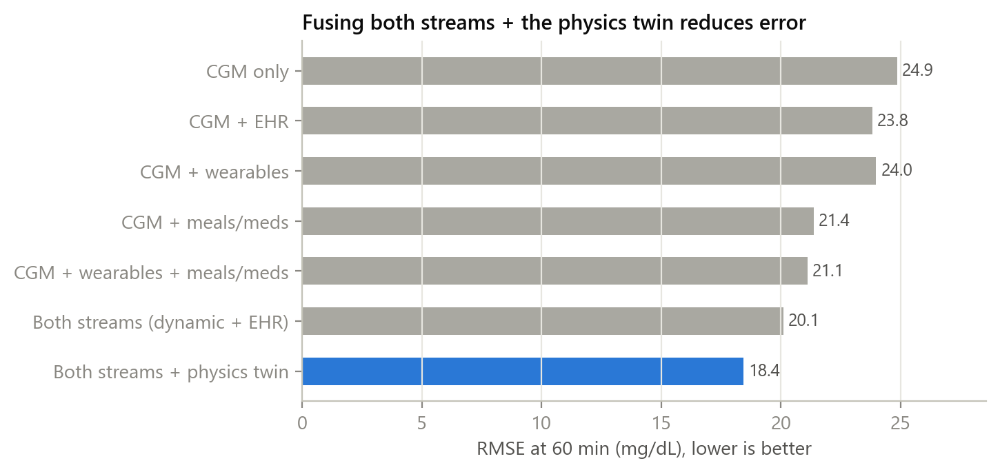
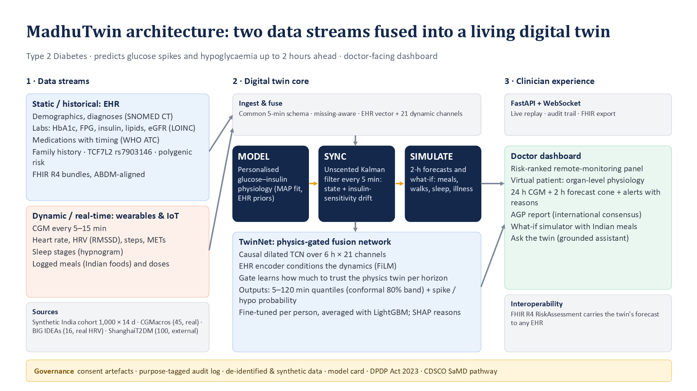
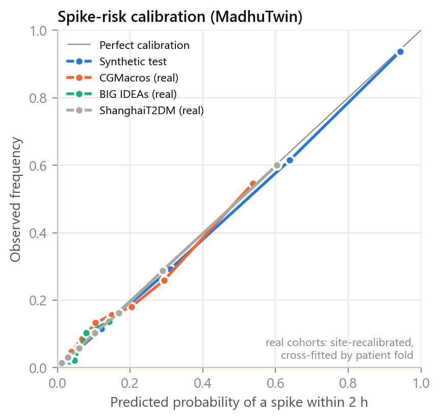
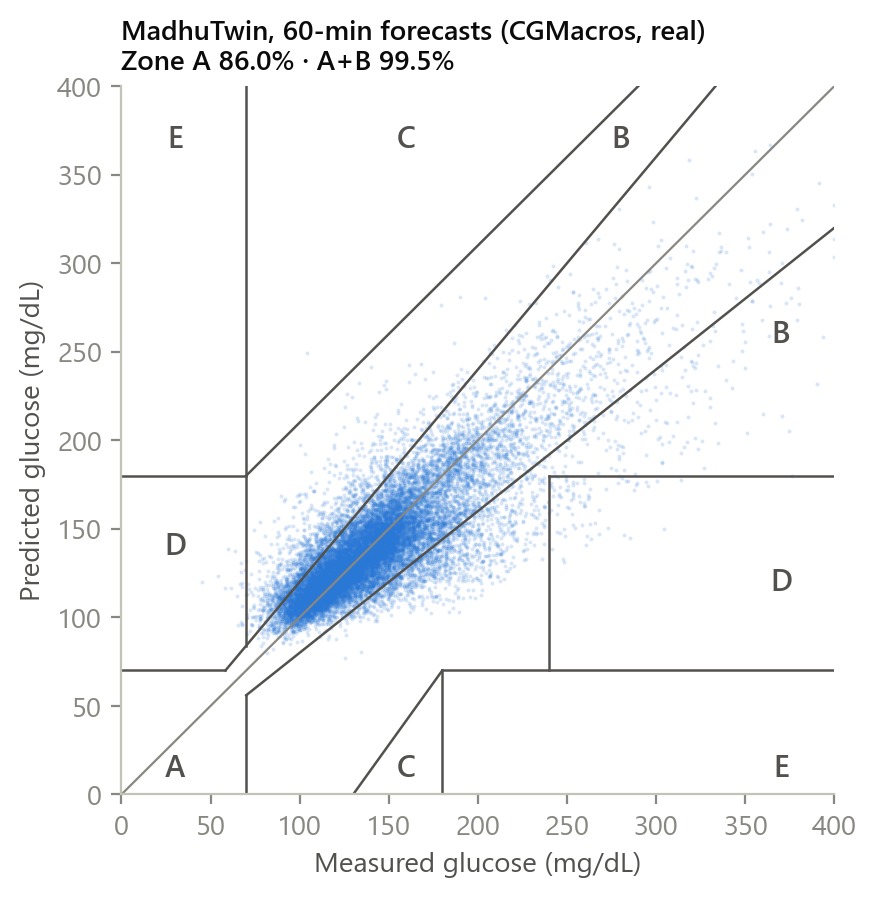
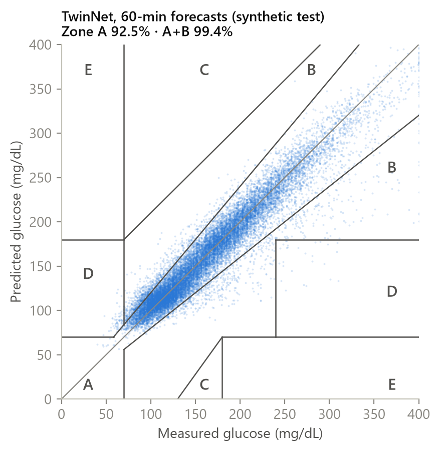
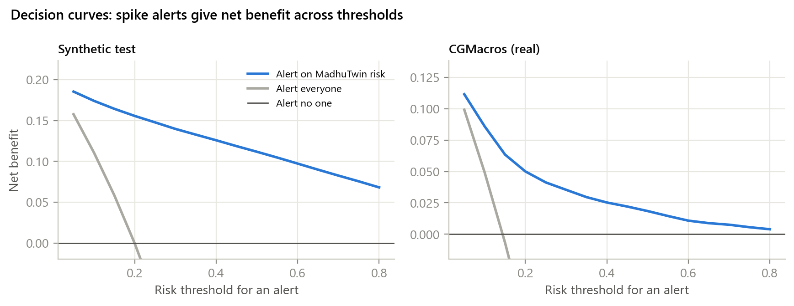
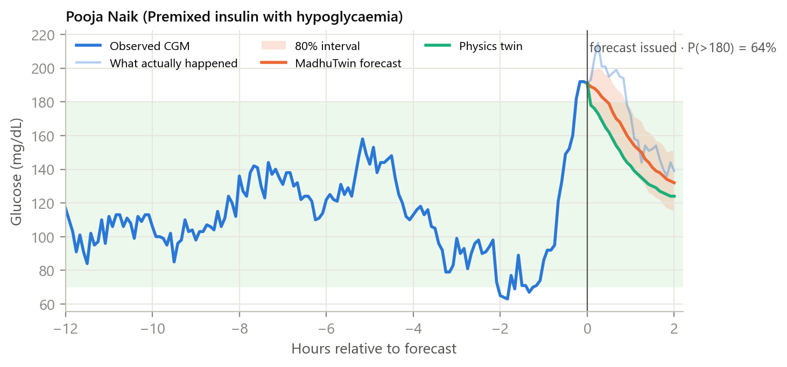
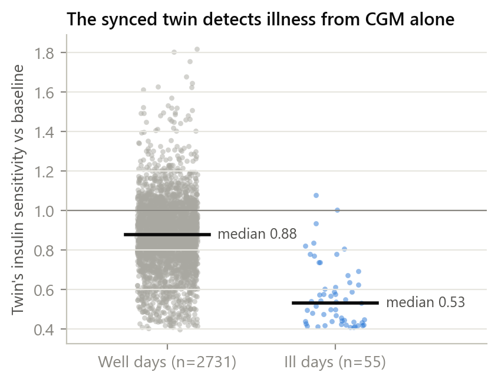
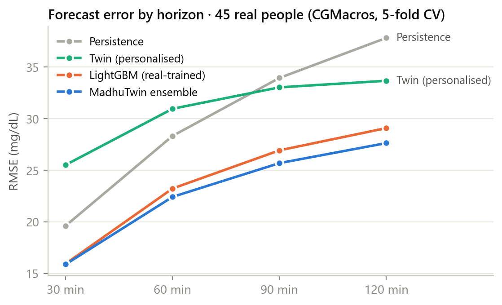
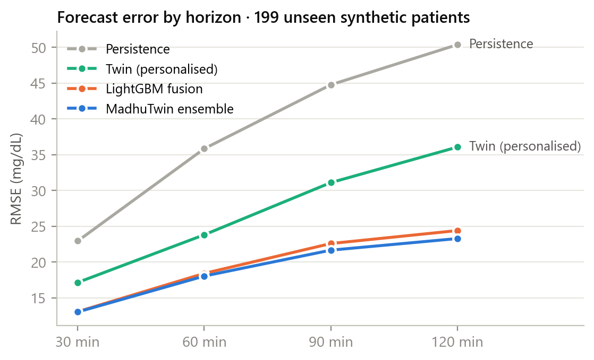
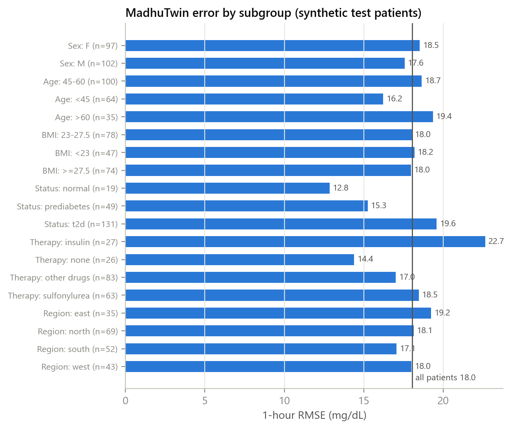
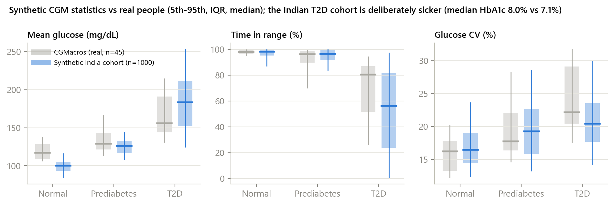
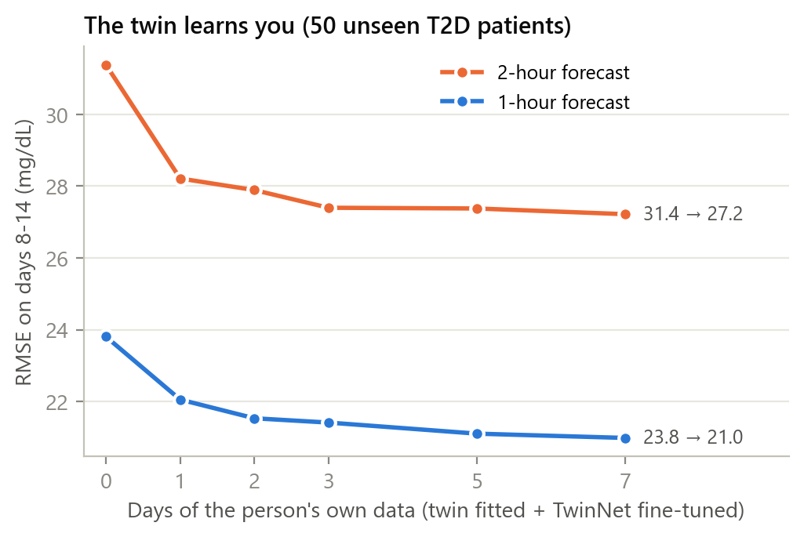
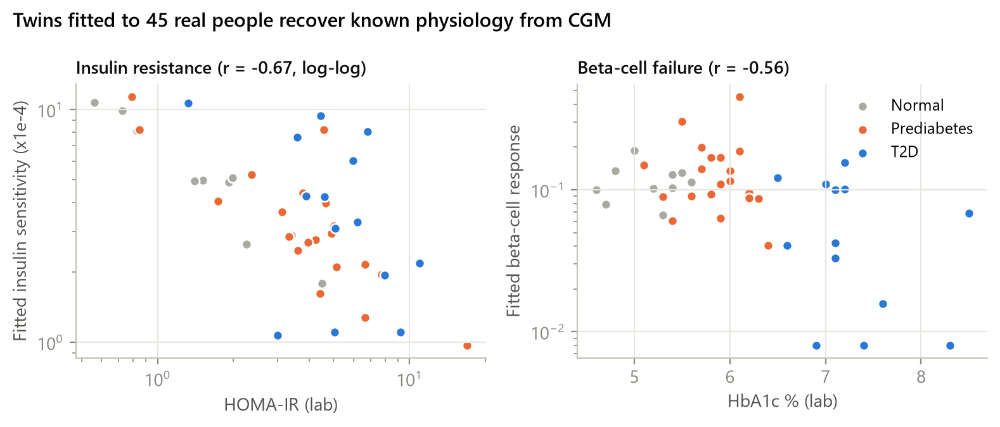
